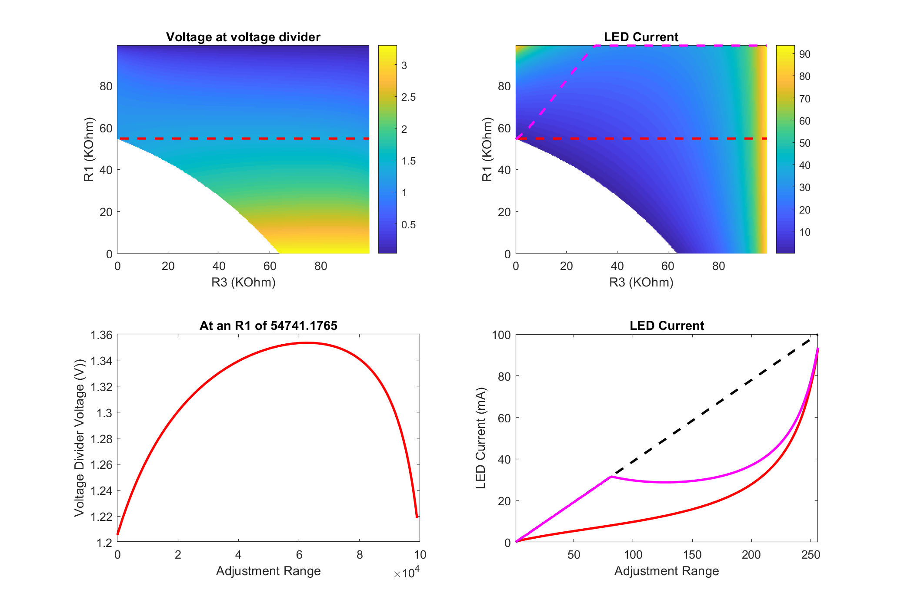

# MS_v4_ETL_LED_Driver

A single PCB for driving an excitation LED and ETL. 

## KiCad Folder

Holds the PCB design files for the PCB.

## MATLAB Folder

Holds a script that simulates the current output of the LED driver based on the dual digital potentiometer values.

