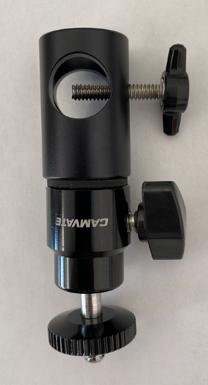
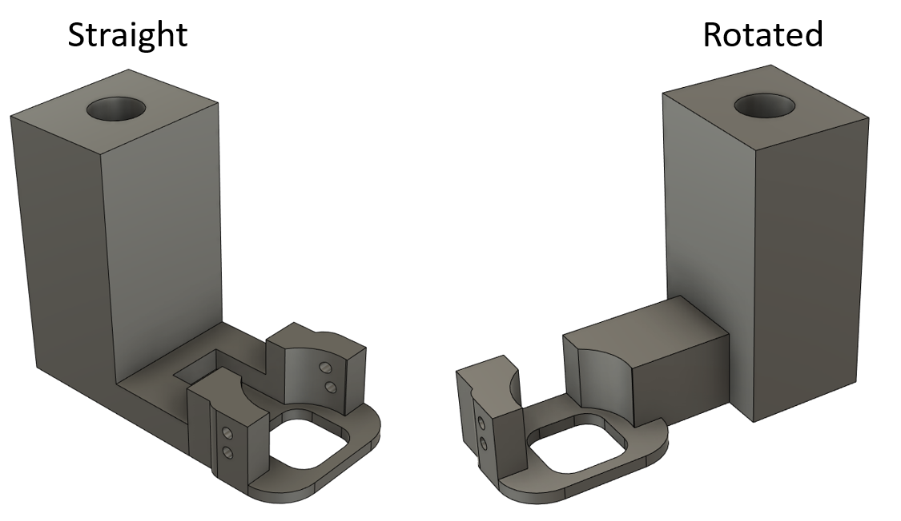
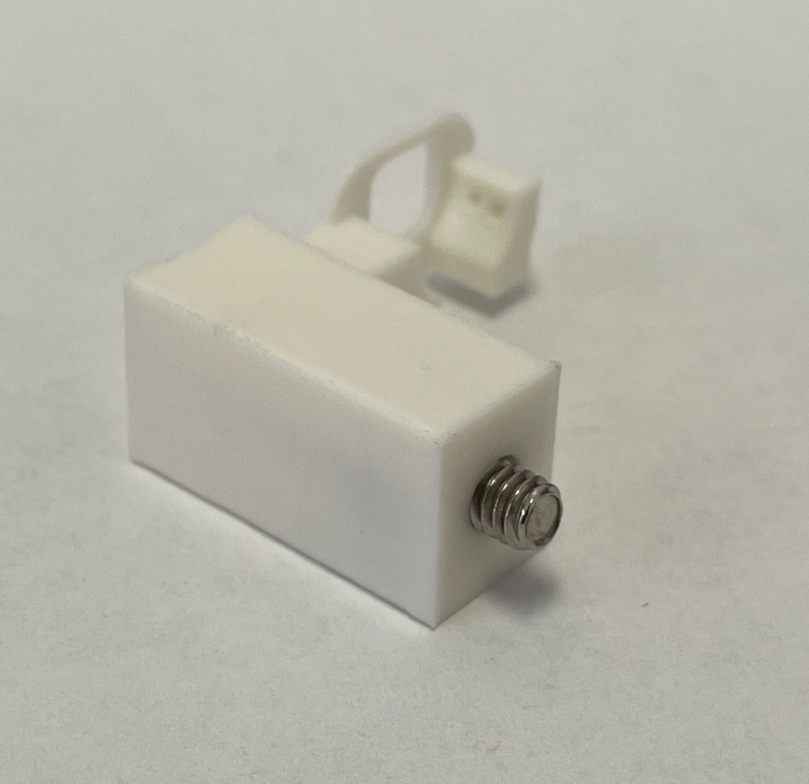
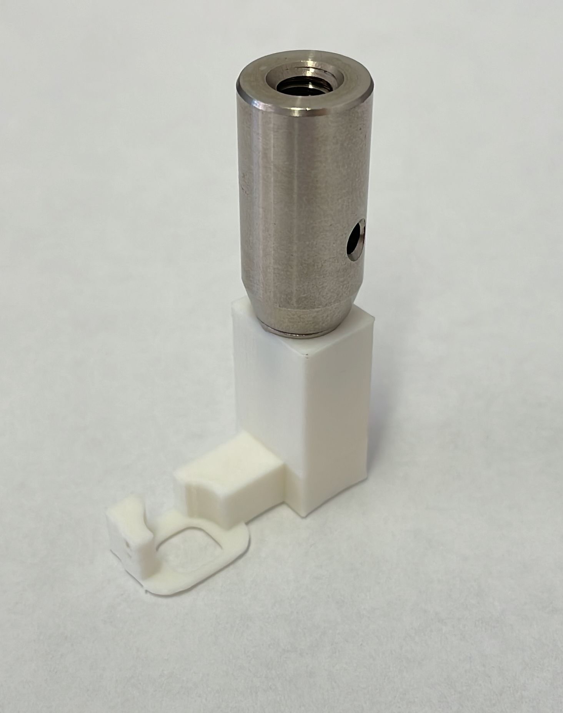
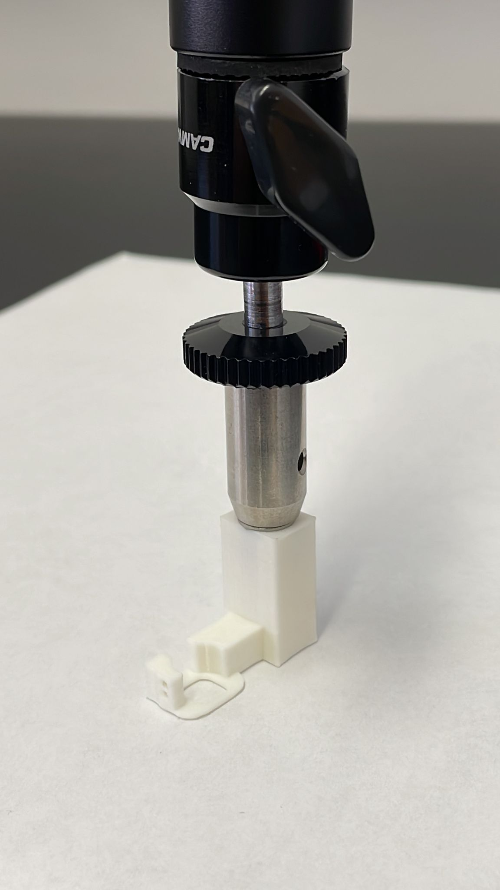
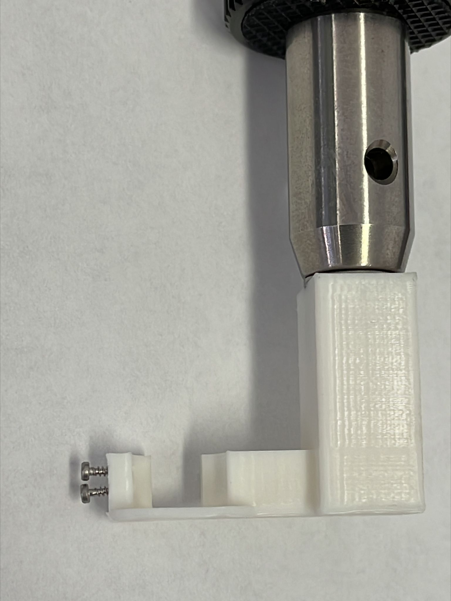

# Stereotaxic holder for v4 miniscopes

This repository holds the design files and information to assemble a holder for v4 miniscopes for being used in stereotaxic setups

## Bill of materials

| Item  | Description | Link |
| ------------- | ------------- | ------------- | 
| 1  | Thumb Screws Two-Arm, 10-24 Thread, 1" Long  | [Mcmaster](https://www.mcmaster.com/91185A899/) |
| 2  | Articulated 1/4''-20 Mini Ball Head  | [Amazon](https://www.amazon.com/gp/product/B07LCBVQF8/ref=ppx_yo_dt_b_search_asin_title?ie=UTF8&psc=1) |
| 3  |  Ø1/2" Optical Post  | [Thorlabs](https://www.thorlabs.com/thorproduct.cfm?partnumber=TR1) |
| 4  | 8-32 Stainless Steel Cap Screws, 5/16" Long  | [Thorlabs](https://www.thorlabs.com/thorproduct.cfm?partnumber=SH8S031) |
| 5  | 3D Printed part  | This repository |
| 6  | Thread-Forming Screws for Thin Plastic, M1 Size  | [Mcmaster](https://www.mcmaster.com/96817A707/) |

## Orientation options

This holder can be printed in two orientations depending on how it fit best in the stereotax

## Assembly instructions

### 1. Insert the thumb screw (1) in the articulated mount (2)

### 2. Insert the 8-32 screw (4) on the 3D printed part (5)

### 3. Screw the optical post (3) 

### 4. Screw the optical post to the articulated mount (2) 

### 5. Put the thread-forming screws (6) on the side of the 3D printed part (6)

